# **Relatório**

**Construção e Análise de Algoritmos (CAA)**  
**Equipe:**   
Caíque Fernandes, Emilly Jullyane, Guilherme Leandro, Letícia Alves, Maria Clara, Raquel Lucena

O presente relatório apresenta os resultados obtidos a partir de uma série de testes com vários algoritmos de ordenação implementados em Python. Foram usados as bibliotecas random e time da própria linguagem. Os algoritmos implementados no estudo foram o Selection sort, Bubble sort e Insertion sort que seguem descritos em seus respectivos tópicos.

# **Os Algoritmos**

1. Selection Sort
   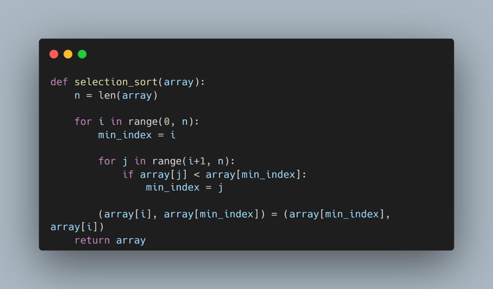

   O Selection Sort é um algoritmo de ordenação que funciona selecionando o menor elemento de um arranjo e colocando-o na primeira posição, depois selecionando o segundo menor elemento e colocando-o na segunda posição, e assim sucessivamente até que o arranjo esteja ordenado.

   

   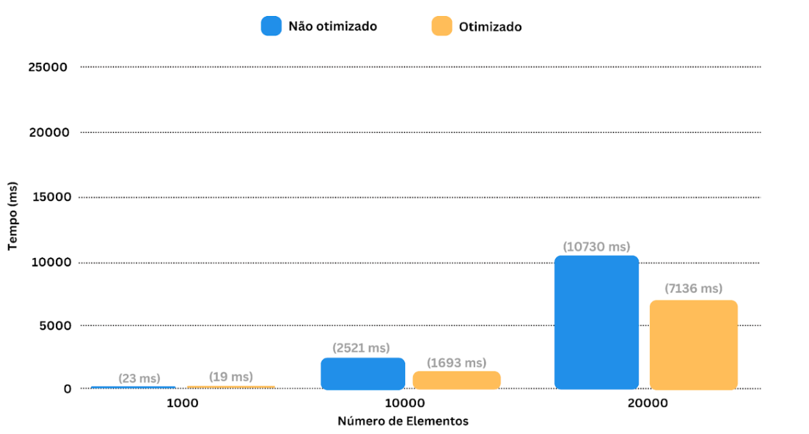

   

   

2. Bubble Sort

   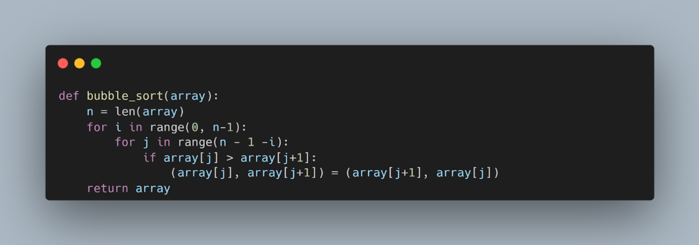

   A complexidade do Bubble sort é O(n2), no pior caso e no caso médio, onde n é o número de elementos na lista. No entanto, no melhor caso, quando a lista já está ordenada, a complexidade é O(n).

   

   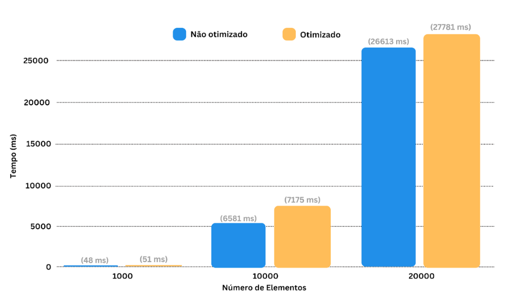

   

   

   

   

3.  Insertion Sort

   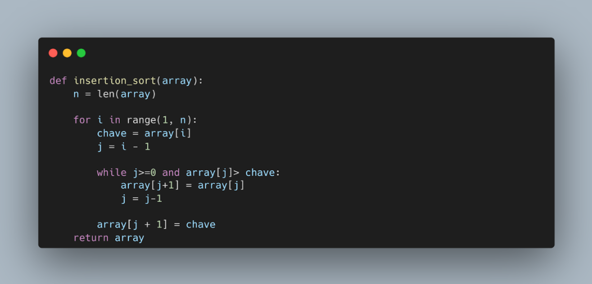

 

   O *Insertion Sort* é um algoritmo de ordenação que organiza os elementos de uma lista iterativamente, simulando a forma como cartas são organizadas na mão. Ele percorre a lista da esquerda para a direita, pegando um elemento por vez e inserindo-o na posição correta em relação aos elementos já ordenados à sua esquerda. Para isso, compara o elemento atual com os anteriores e o desloca até encontrar sua posição adequada. Apesar de simples e eficiente para listas pequenas ou quase ordenadas, tem complexidade de O(n²) no pior caso, quando a lista está em ordem inversa.

   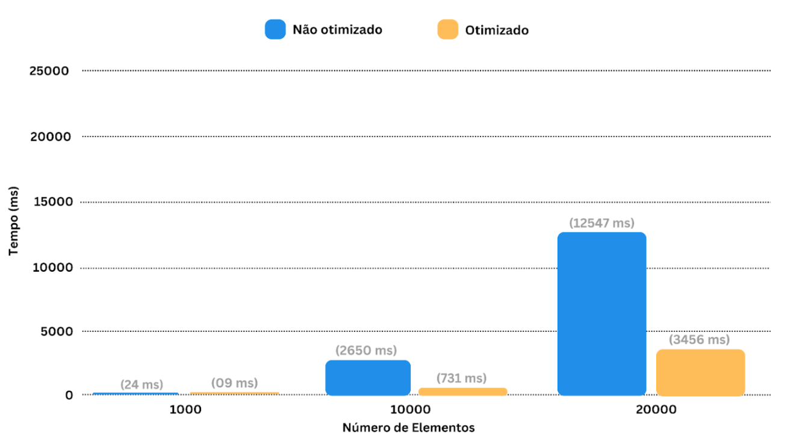

   # **Os Algoritmos Otimizados**

1. Selection Sort
   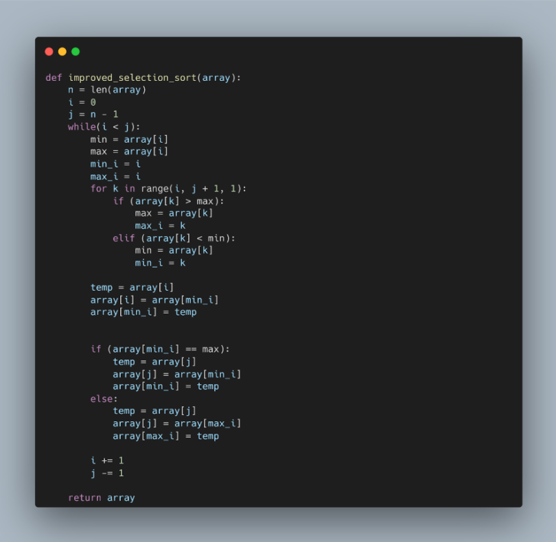

   O Selection Sort pega o menor valor e coloca em sua posição correta. O algoritmo otimizado aproveita também o valor máximo em cada laço de repetição e colocá-lo na posição correta. Assim, a ordenação é feita usando tanto os valores mínimos como os máximos. Assim, diminui o número de iterações que o algoritmo executa, mas mantém o mesmo número de trocas.

   

   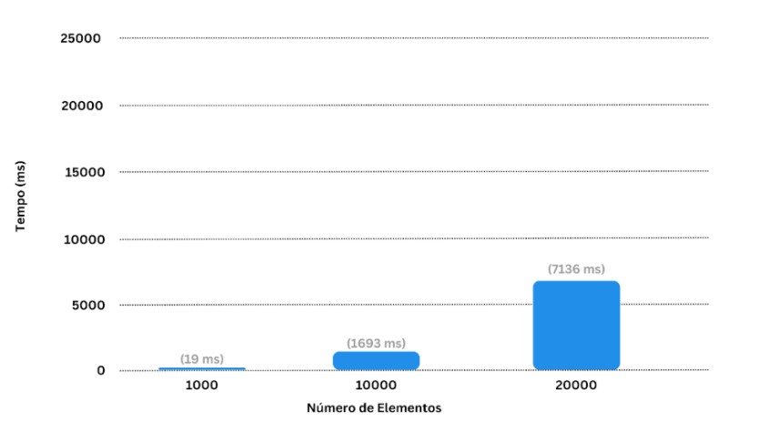

   

2. Bubble Sort
   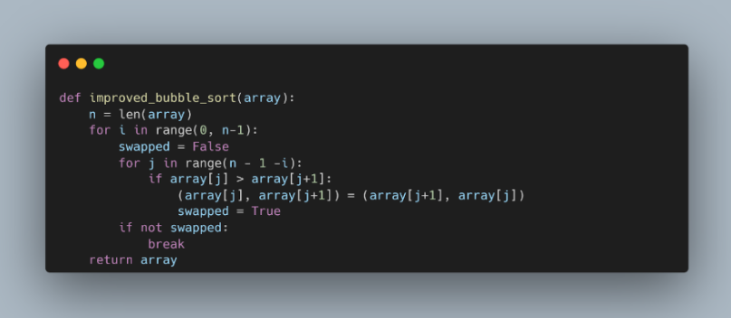

   Usa uma variável para registrar se alguma troca foi feita no loop interno. Se nenhuma troca foi feita, então o array já está ordenado e podemos parar o algoritmo, evitando percorrer o array várias vezes desnecessariamente. 

   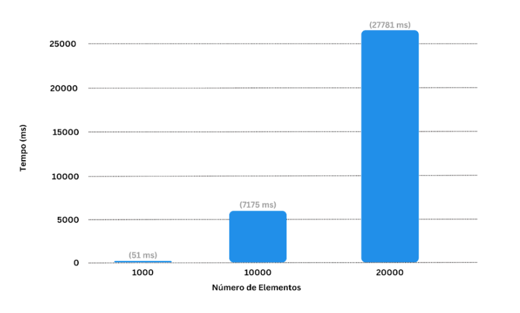

   

3.  Insertion Sort

   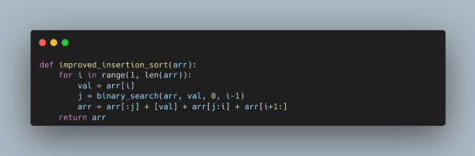

   No algoritmo Insertion Sort otimizado, substituímos a busca pelo local onde deve ser feita uma troca de uma busca linear por uma busca binária, reduzindo o tempo de inserção de um valor de O (N) para O (log N).

   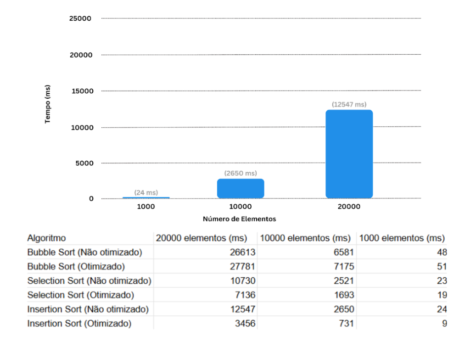
